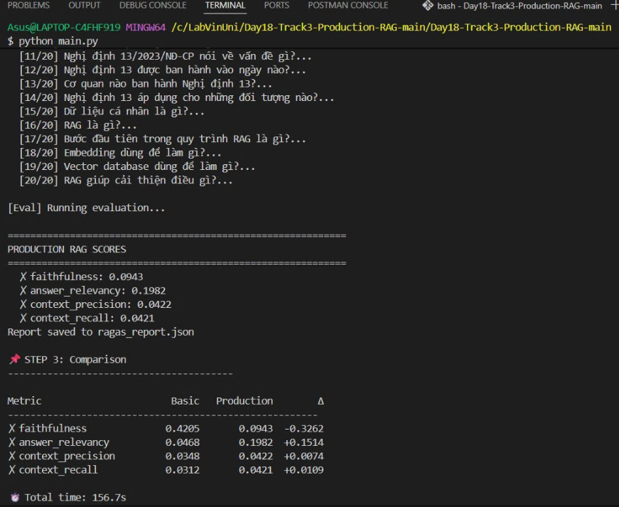
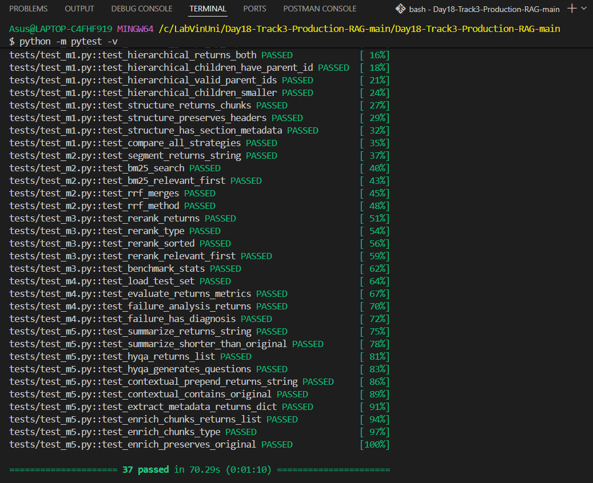
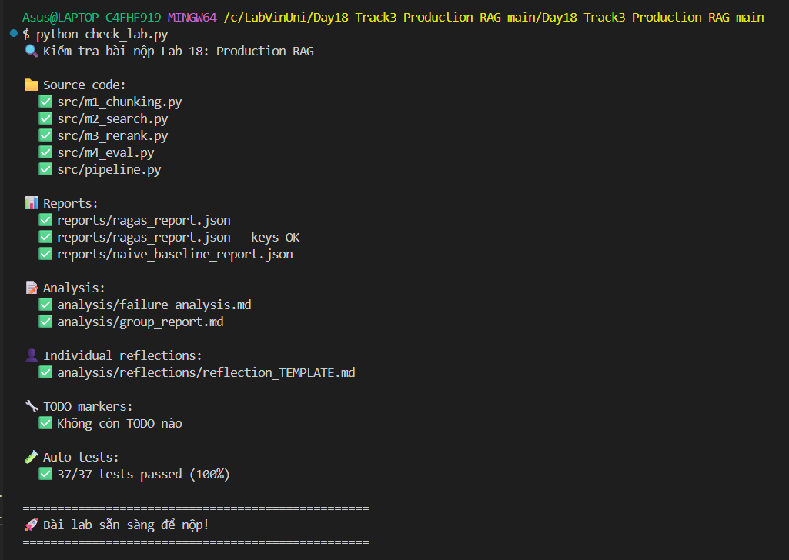

# Lab 18: Production RAG Pipeline

**AICB-P2T3 · Ngày 18 · Production RAG**  
**Student:** 2A202600218-Nguyễn Tiến Đạt**  
**Giảng viên:** M.Sc Trần Minh Tú · **Thời gian:** 2 giờ


---

## 🧪 Kết quả:
### Output python main.py

### Output 5 test m1->m5:

### Output check_lab.py


## Tổng quan

Lab gồm **2 phần**:

| Phần | Hình thức | Thời gian | Mô tả |
|------|-----------|-----------|-------|
| **Phần A** | Cá nhân | 1.5 giờ | Implement 1 trong 4 modules |
| **Phần B** | Nhóm (3–4 người) | 30 phút | Ghép modules → full pipeline → eval → present |

```
  Cá nhân                         Nhóm
  ┌────────────┐
  │ M1 Chunking│──┐
  ├────────────┤  │    ┌──────────────────────────────┐
  │ M2 Search  │──┼───▶│  Production RAG System        │
  ├────────────┤  │    │  pipeline.py + RAGAS eval     │
  │ M3 Rerank  │──┤    │  + failure analysis           │
  ├────────────┤  │    └──────────────────────────────┘
  │ M4 Eval    │──┘
  └────────────┘
```

## Quick Start

```bash
git clone <repo-url> && cd lab18-production-rag
docker compose up -d                    # Qdrant
pip install -r requirements.txt
cp .env.example .env                    # Điền API keys
python naive_baseline.py                # ⚠️ Chạy TRƯỚC để có baseline
```

## Chạy toàn bộ

```bash
python main.py                          # Naive + Production + So sánh
python check_lab.py                     # Kiểm tra trước khi nộp
```

## Cấu trúc repo

```
lab18-production-rag/
├── README.md                   # File này
├── ASSIGNMENT_INDIVIDUAL.md    # ★ Đề bài cá nhân (Phần A)
├── ASSIGNMENT_GROUP.md         # ★ Đề bài nhóm (Phần B)
├── RUBRIC.md                   # Hệ thống chấm điểm chi tiết
│
├── main.py                     # Entry point: chạy toàn bộ pipeline
├── check_lab.py                # Kiểm tra định dạng trước khi nộp
├── naive_baseline.py           # Baseline (chạy trước)
├── config.py                   # Shared config
├── requirements.txt            # Dependencies (pinned)
├── docker-compose.yml          # Qdrant local
├── .env.example                # API keys template
│
├── data/                       # Sample corpus tiếng Việt
│   ├── sample_01.md
│   ├── sample_02.md
│   └── sample_03.md
├── test_set.json               # 20 Q&A pairs
│
├── src/                        # ★ Scaffold code (có TODO markers)
│   ├── m1_chunking.py          # Module 1: Chunking
│   ├── m2_search.py            # Module 2: Hybrid Search
│   ├── m3_rerank.py            # Module 3: Reranking
│   ├── m4_eval.py              # Module 4: Evaluation
│   └── pipeline.py             # Ghép nhóm
│
├── tests/                      # Auto-grading
│   ├── test_m1.py
│   ├── test_m2.py
│   ├── test_m3.py
│   └── test_m4.py
│
├── analysis/                   # ★ Deliverable
│   ├── failure_analysis.md     # Phân tích failures (nhóm)
│   ├── group_report.md         # Báo cáo nhóm
│   └── reflections/            # Reflection cá nhân
│       └── reflection_TEMPLATE.md
│
├── reports/                    # ★ Auto-generated (sau khi chạy main.py)
│   ├── ragas_report.json
│   └── naive_baseline_report.json
│
└── templates/                  # Templates gốc (backup)
    ├── failure_analysis.md
    └── group_report.md
```

## Timeline

| Thời gian | Hoạt động |
|-----------|-----------|
| 0:00–0:15 | Setup + chạy `naive_baseline.py` |
| 0:15–1:45 | **Phần A (cá nhân):** implement module → `pytest tests/test_m*.py` |
| 1:45–2:15 | **Phần B (nhóm):** ghép → `python src/pipeline.py` → failure analysis |
| 2:15–2:30 | Presentation 5 phút/nhóm |
